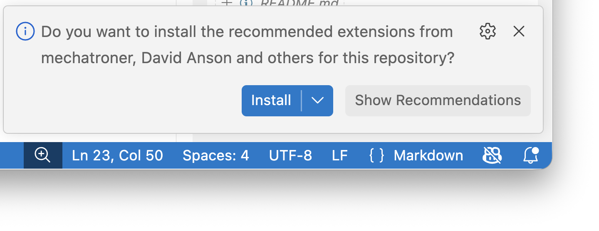
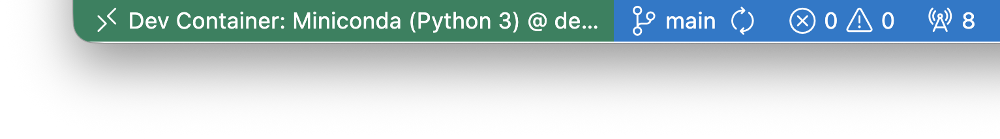

# PAC3

## Utilització del codi

L'avantatge d'utilitzar un contenidor o un entorn virtual és que permet aïllar
les dependències del projecte del sistema operatiu, evitant conflictes entre
diferents projectes i versions de biblioteques.

### OPCIÓ 1: Desenvolupament amb Dev Containers

#### Requisits

- Docker Desktop [instal·lar](https://www.docker.com/products/docker-desktop/)
- Visual Studio Code: [instal·lar](https://code.visualstudio.com/)
- Remote Development, extensió de Visual Studio Code: [instal·lar](https://marketplace.visualstudio.com/items?itemName=ms-vscode-remote.vscode-remote-extensionpack)

#### Creació del contenidor

Una vegada oberta la carpeta del projecte a VS Code, clicarem a la icona
"Open a Remote Window" i seleccionarem "Reopen in Container".

<p align="center">
  
</p>

Aquesta ordre crearà un contenidor i instal·larà totes les dependències. Una
vegada s'ha completat el procés de creació del contenidor, cal instal·lar les
extensions recomanades per al projecte:

<p align="center">
  
</p>

Un cop creat i activat l'entorn virtual, ja es pot executar el codi a VS Code.

> [!IMPORTANT]
> Abans d'iniciar o crear el contenidor cal que Docker Desktop estigui en execució.

Per tancar la connexió, clicarem a la icona "Dev Container: Miniconda" i
seleccionarem "Close Remote Connection". El contenidor es pot aturar des del
tauler de Docker Desktop.

<p align="center">
  
</p>

### Opció 2: Conda

#### Requisits de Conda

- miniconda
  - (macos) es recomana instal·lar-ho a través de [Homebrew](https://brew.sh/)
  - (windows) es recomana utilitzar l'[instal·lador](<<https://www.anaconda.com/docs/getting-started/miniconda/install/overview>)
- Visual Studio Code: [instal·lar](https://code.visualstudio.com/)

#### Creació de l'entorn virtual

Per crear un entorn virtual amb conda, executeu la següent ordre al directori
arrel del projecte:

```sh
conda env create --prefix=./.conda --file=environment.yml
```

Per tal d'assegurar que l'entorn virtual s'ha creat correctament, podeu
comprovar que el directori `.conda/` s'ha creat al directori arrel del projecte.

> [!TIP]
> Miniconda requereix menys espai i és més lleuger que Anaconda. Per a
> instal·lar Miniconda en sistemes macOS, podeu utilitzar Homebrew:

```sh
brew install --cask miniconda
conda init
conda config --set auto_activate_base False
source ~/.bash_profile
conda tos accept --override-channels --channel https://repo.anaconda.com/pkgs/main
conda tos accept --override-channels --channel https://repo.anaconda.com/pkgs/r
```

>
> [!NOTE]
> Podeu utilitzar l'extensió de Visual Studio Code
> [Python](https://marketplace.visualstudio.com/items?itemName=ms-python.python)
> per gestionar entorns virtuals i executar codi Python dins de l'editor.
> Per crear un entorn virtual amb conda, accediu a la paleta d'ordres
> (`Ctrl+Shift+P` o `Cmd+Shift+P` a macOS) i escriviu "Python: Create Environment".

> [!IMPORTANT]
> Si voleu canviar l'intèrpret de Python utilitzat per Visual Studio Code,
> podeu fer-ho des de la paleta d'ordres (`Ctrl+Shift+P` o `Cmd+Shift+P` a macOS)
> escrivint "Python: Select Interpreter" i seleccionant l'intèrpret de l'entorn
> virtual que heu creat. Cal tenir en compte que l'intèrpret se seleccionarà
> automàticament amb l'entorn virtual quant aquest s'hagi creat amb l'extensió
> comentada en la nota anterior.

#### Activació i desactivació de l'entorn virtual

Per activar l'entorn virtual, executeu la següent ordre:

```sh
conda activate ./.conda
```

Per a desactivar l'entorn virtual, executeu la següent ordre:

```sh
conda deactivate
```

> [!TIP]
> Per canviar el prompt de l'entorn virtual i que mostri el nom de l'entorn,
> un cop activat, podeu executar la següent ordre per escurçar-lo:

```sh
conda config --set env_prompt '({name}) '
```
